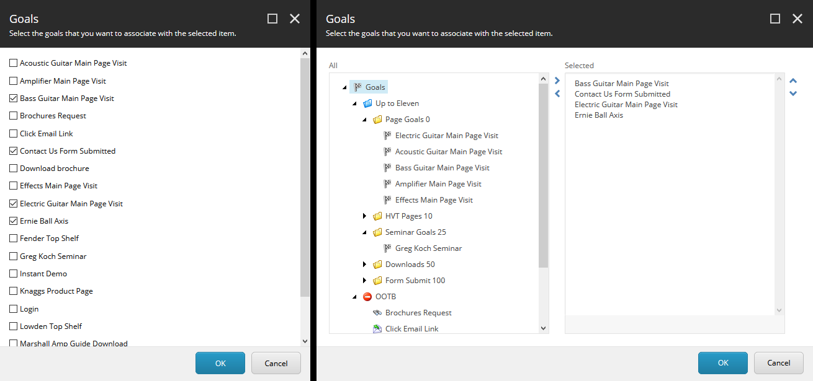
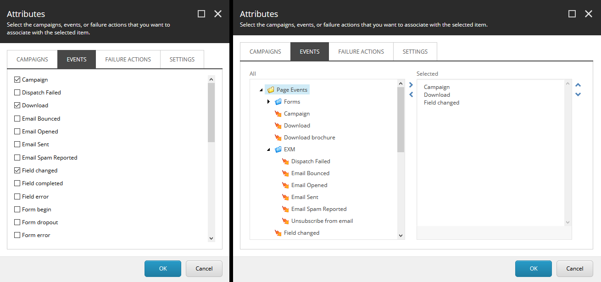

# ✨ Improved Tracking Controls

This repository contains code for the improved tracking controls that
[Rick Bauer][1] and I demonstrated in our _Crank Up Your Sitecore Authoring
and Marketing Experience_ presentation.

These improved controls make it easier for marketers to manage large sets of
goals, campaigns, page events, and failures.

The improved goal selector is pictured on the right, stock selector on the left:

And the improved attributes selector is on the right, with stock on the left:

## 🏗️ Setup

### 🐳 Docker

1. Build the Sitecore 9.3 docker images using the steps in the
   [Sitecore Docker images repository][2].
2. Build the solution with the `Docker` build configuration.
3. All projects in the solution will be automatically published to Docker on
   build courtesy of [Helix Publishing Pipeline][3].
4. On the command line:
   1. `cd C:\[path-to]\sitecore-improved-tracking-controls`
   2. `docker-compose up`

### 💽 Locally

1. Install a new instance of [Sitecore 9.3][4].
2. Update the `publishUrl` in [`PublishSettings.Sitecore.targets`][5] to your
   Sitecore installation's web root (e.g., `C:\inetpub\wwwroot\sc93.sc`).
3. Update the `sourceFolder` in [`CoreyAndRick.Project.Common.Dev.config`][6] to
   point to the root of this repository on your disk.
4. Build the solution with the `Debug` build configuration.
5. All projects in the solution will be automatically published to Sitecore on
   build courtesy of [Helix Publishing Pipeline][3].

## 💡 Notes

- This repository contains Sitecore Support patch [`Sitecore.Support.205766`][7]
  to fix an issue with the built-in `TreeList` control. Please see the
  [`README.md` with that patch][8] for more information.

[1]: https://twitter.com/Sitecordial
[2]: https://github.com/sitecore/docker-images
[3]: https://github.com/richardszalay/helix-publishing-pipeline
[4]: https://dev.sitecore.net/Downloads/Sitecore_Experience_Platform/93/Sitecore_Experience_Platform_93_Initial_Release.aspx
[5]: PublishSettings.Sitecore.targets
[6]: src/Project/Common/sitecore/App_Config/Environment/CoreyAndRick.Project.Common.Dev.config
[7]: https://github.com/SitecoreSupport/Sitecore.Support.205766
[8]: lib/README.md
